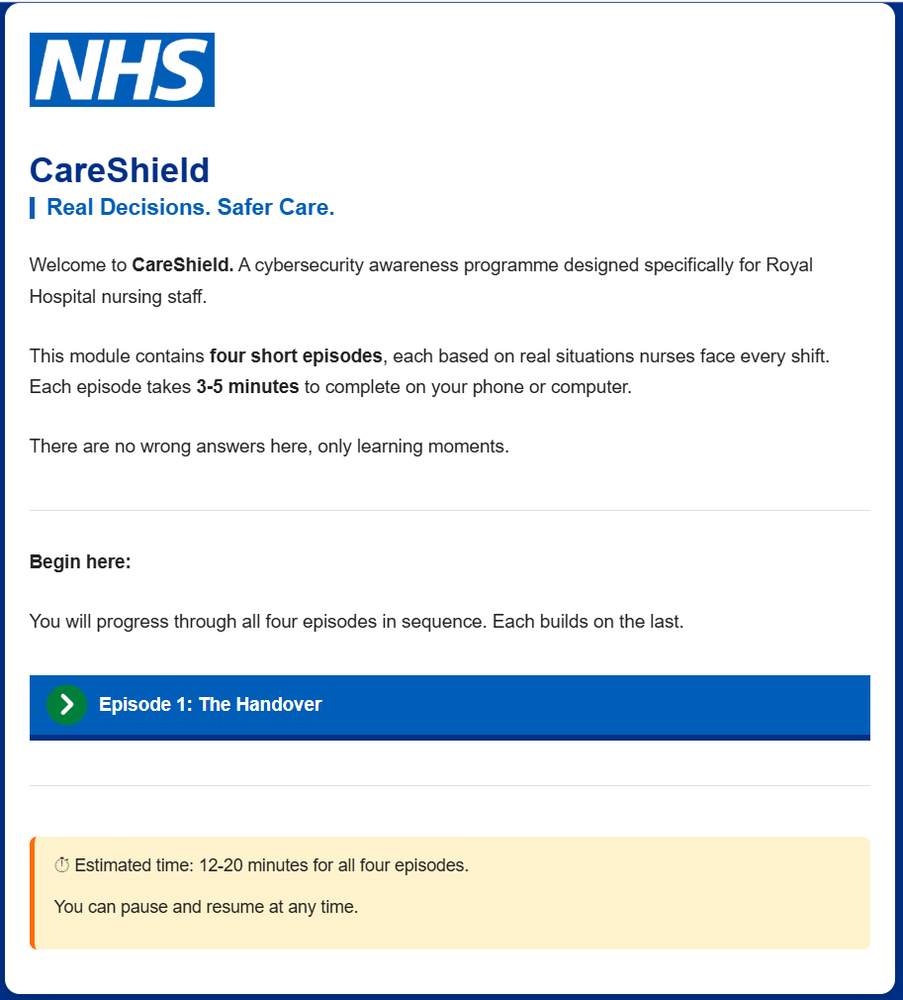
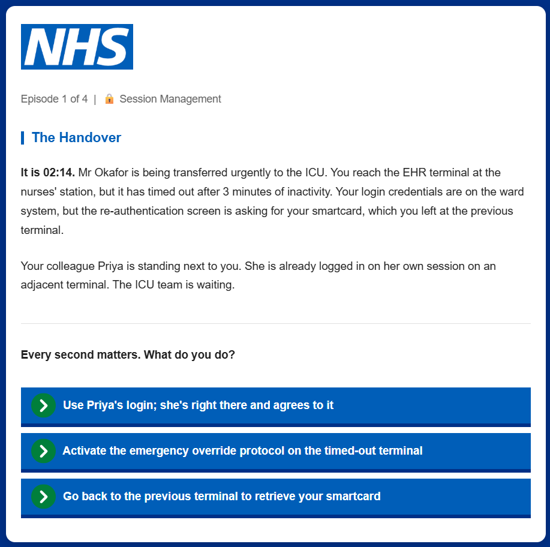
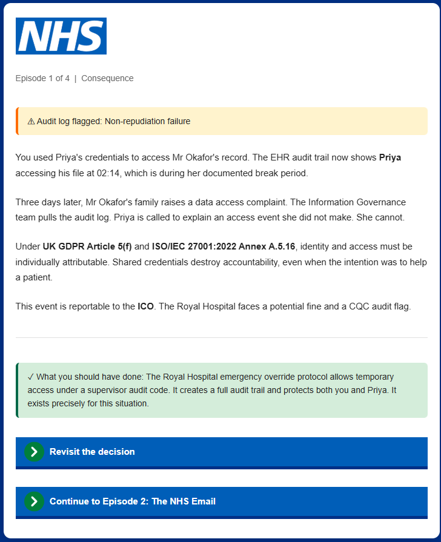
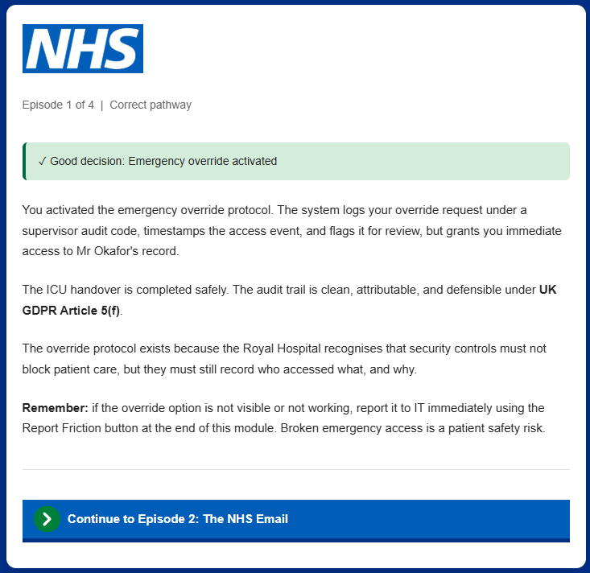
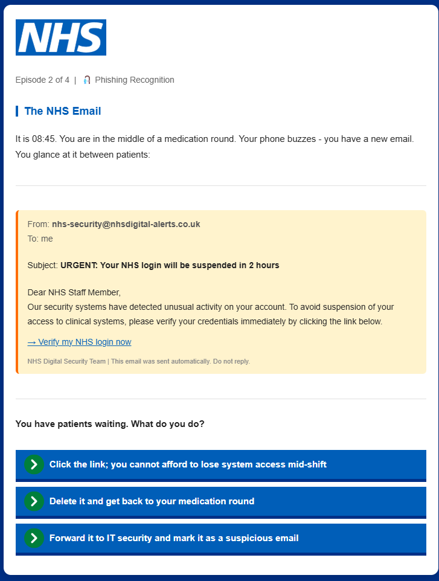
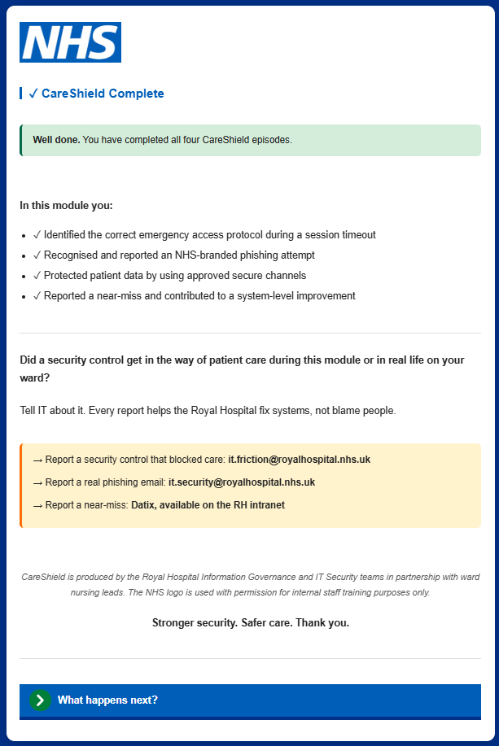

# 🏥 CareShield: NHS Nursing Staff Cybersecurity Awareness Campaign


---

## 📌 Project Overview

**CareShield** is a mobile-optimised interactive cybersecurity awareness campaign built for nursing staff at a fictional Royal Hospital NHS Trust. It addresses a documented gap in clinical security training: the mismatch between generic annual e-learning and the specific operational pressures that drive insecure workarounds in nursing environments.

The project is grounded in Zimmermann et al.'s (2024) human-centred cybersecurity framework: nurses are not the weak link, but expert users working inside poorly aligned systems. CareShield targets both behaviour and the system design conditions that produce insecure workarounds.

- ✅ **4-episode branching scenario** - active decision-making, not passive reading (builds self-efficacy)
- ✅ **3-5 minutes per episode** - microlearning at shift-change, not annual block delivery
- ✅ **Report Friction pathway** - two-way feedback: nurses log usability barriers to IT
- ✅ **NHS branding** - #003087 blue, plain English, real EHR interfaces and phishing templates
- ✅ **WCAG 2.1 AA compliant** - mobile-optimised, works on any device browser
- ✅ **5 measurable outcomes** - phishing click rate, incident reporting, knowledge retention, SIEM alerts, culture survey

> 📄 **[Download the full project portfolio document](./CareShield_Personal_Project_Ajoku.pdf)**
>
> 🎮 **[Launch the CareShield module](https://y5b76.github.io/CareShield-NHS-Nursing-Cybersecurity-Awareness-Campaign/Artefact.html)** - open in any browser, no installation required

---

## 🧠 Design Framework

```
PROBLEM DIAGNOSIS
Nurses: breadth of system access + time pressure + workflow-security conflict
    |
    v
ROOT CAUSE ANALYSIS (NCSC/ENISA Cyber Security Culture Framework)
    |-- Workflow-security conflict       -> Report Friction pathway
    |-- Compliance budget exhaustion     -> 3-5 min microlearning at shift-change
    |-- Security treated as secondary    -> Emergency override pathways
    |-- Low personal relevance           -> RH characters, NHS phishing templates
    |-- Low psychological safety         -> Non-punitive framing; reporting as duty
    |
    v
INTERVENTION: CareShield (Twine/Harlowe branching scenario)
    |
    v
MEASUREMENT (NIST SP 800-50 Rev. 1 Programme Lifecycle)
    Baseline -> M3 -> M6 -> M12
    Phishing click rate | Incident reports | Completion | SIEM alerts | Culture survey
```

---

## 🗂️ Project Structure

```
careshield-nhs-awareness-campaign/
|
|-- README.md
|-- CareShield_Personal_Project_Ajoku.pdf    <- Full portfolio document
|-- Artefact.html                            <- CareShield interactive module (open in browser)
|
|-- screenshots/
    |-- 01_start_screen.png
    |-- 02_episode1_decision_screen.png
    |-- 03_episode1_wrong_choice_consequence.png
    |-- 04_episode1_correct_pathway.png
    |-- 05_episode2_phishing_decision.png
    |-- 06_completion_screen.png
```

---

## ⚙️ Tech Stack

| Component | Role |
|---|---|
| **Twine 2.12.0** | Interactive story authoring tool |
| **Harlowe 3.3.9** | Twine story format (branching logic engine) |
| **HTML / CSS** | Single-file deployment - no server required |
| **NHS Design System colours** | #003087 (NHS Blue), #005EB8 (NHS Bright Blue) |
| **WCAG 2.1 AA** | Accessibility compliance standard |
| **Netlify / GitHub Pages** | Deployment (standalone HTML file) |

---

## 🏥 Part 1 - User Group Analysis

### Why Nursing Staff

Three convergent risk factors create a uniquely challenging security environment:

| Risk Factor | Evidence | Impact |
|---|---|---|
| Breadth of system access | Multiple EHR, medication, imaging, comms systems per ward | Each system requires independent authentication |
| Operational time pressure | Patient care interruptions every 3-5 minutes on average | Re-authentication demands clash with clinical urgency |
| Workflow-security conflict | Koppel et al. (2015) - nurses marked workstations to avoid re-auth | Compliance budget overload -> rational workarounds |

> **Compliance Budget (Beautement, Sasse and Wonham, 2008):** repeated security demands cause behavioural disengagement through cognitive overload, not indifference. The nurse who shares a login is not being careless - they are rationally prioritising patient care within a system that has made secure access operationally incompatible with clinical workflow.

### Security Control Friction Mapping

| Security Control | Usability Friction | Workaround | Organisational Risk |
|---|---|---|---|
| Session timeout | Re-auth during emergencies | Shared login; persistent sessions | Non-repudiation failure; GDPR breach |
| Password rotation | Multiple systems; frequent resets | Reuse; sticky notes | Credential compromise; lateral movement |
| MFA | Extra step during urgent tasks | Shared OTPs; bypass requests | Control weakened |
| RBAC | Access delays during patient transfers | Credential borrowing from colleagues | Access policy violation |

### Regulatory Gap

| Standard | Requirement | RH Current State | CareShield |
|---|---|---|---|
| ISO/IEC 27001:2022 Annex A.6.3 | Training proportionate to role | Generic annual e-learning | Role-specific, scenario-based |
| NIST SP 800-50 Rev. 1 | Tier 2 role-based training for high-risk staff | Tier 1 generic awareness | Tier 2 compliant |
| NIST SP 800-53 Rev. 5 AT-2/AT-3 | Frequency and role alignment | Annual only | Shift-change microlearning |

---

## 🎮 Part 2 - The CareShield Artefact

### Why Branching Scenarios (Not Posters or Phishing Simulations)

| Format | Limitation | Why CareShield is better suited |
|---|---|---|
| Posters / infographics | Awareness only - no decision building | Branching builds decision habit under pressure, not just knowledge |
| Phishing simulations | Diagnostic, not instructional (Malik et al., 2026) | CareShield provides instructional feedback at each decision point |
| Facilitator-led workshops | Incompatible with shift patterns | Async mobile delivery at shift change; no scheduling dependency |
| Annual e-learning | Generic; Tier 1 not Tier 2 standard | Role-specific; NIST 800-50 Tier 2 compliant; frequency-appropriate |

### Episode Structure

| Episode | Scenario | Root Cause Addressed | Security Concept |
|---|---|---|---|
| 1: The Handover | Session timeout during emergency patient transfer | Structural incompatibility | Session management; non-repudiation; emergency access protocol |
| 2: The NHS Email | Fake NHS Digital email requesting urgent password verification | Time-pressure exploitation | Phishing recognition; reporting pathway |
| 3: The WhatsApp Photo | Nurse photographs medication chart on personal phone to share with GP | Compliance budget; BYOD | UK GDPR; data minimisation; approved secure channels |
| 4: The Near Miss | Shared terminal left logged in; visitor gains access | Psychological safety | Incident reporting; shared accountability; CQC/ICO implications |

### Screenshots

| Fig 1 - Start Screen | Fig 2 - Episode 1 Decision Screen |
|---|---|
|  |  |

| Fig 3 - Wrong Choice Consequence | Fig 4 - Correct Pathway (Emergency Override) |
|---|---|
|  |  |

| Fig 5 - Episode 2 Phishing Decision | Fig 6 - Completion Screen |
|---|---|
|  |  |

### Report Friction Mechanism

The completion screen includes a **Report Friction** button linking to a pre-filled IT request form:

```

The completion screen directs staff to three reporting channels:
- it.friction@royalhospital.nhs.uk  (security control usability issues)
- it.security@royalhospital.nhs.uk  (real phishing emails)
- Datix (near-miss reporting, available on the RH intranet)

```

This turns CareShield into a **two-way improvement tool**: staff report which controls are causing workarounds, and IT can use this data to prioritise UX improvements - directly addressing Koppel et al.'s (2015) finding that workarounds persist because staff have no channel to report the friction that creates them.

---

## 📊 Part 3 - Measurable Outcomes

| Metric | Method | Target | Horizon |
|---|---|---|---|
| Phishing click rate | Simulated NHS phishing campaign | 10% or less by M6 vs Week 0 baseline | Baseline, M3, M6 |
| Incident reporting rate | Helpdesk ticket categorisation | 30% or more increase from baseline | Monthly |
| Module completion and retention | In-module quiz + M3 reassessment | 80% or more pass; 15% or less knowledge decay | Immediate + M3 |
| Credential-sharing events | SIEM anomaly alerts (Splunk/Elastic) | 50% reduction in shared-session events | Quarterly |
| Security culture perception | Anonymous ENISA survey | Shift from compliance-as-burden to compliance-as-normal | Annual |

---

## ⚠️ Critical Reflection

### Key Trade-offs

| Trade-off | Decision Made | Rationale |
|---|---|---|
| Micro-duration (3-5 min) vs depth | Accepted micro-duration | Cognitive overload is the primary disengagement mechanism (Furnell and Thomson, 2009) |
| RH-specific realism vs portability | Accepted specificity | Generic content is less effective because it lacks specific cues that make scenarios feel real (Nifakos et al., 2021) |
| Report Friction vs IT responsiveness dependency | Included with SLA requirement | Without IT response SLA, mechanism damages trust rather than building it (Zimmermann et al., 2024) |

### UK GDPR Considerations

- **Module completion and quiz data:** processed under legitimate interests lawful basis; reported in aggregate only at ward level
- **Report Friction submissions:** personal data (may name colleagues); routed to restricted IT inbox with RBAC; not used for performance management
- **DPIA required** before production deployment (Tambe-Jagtap, 2023)

---

## 🧠 Frameworks and References

| Framework / Reference | Application |
|---|---|
| **ISO/IEC 27001:2022 Annex A.6.3** | Role-proportionate training requirement |
| **NIST SP 800-50 Rev. 1 (2024)** | Tier 2 role-based training standard; programme lifecycle |
| **NIST SP 800-53 Rev. 5 AT-2/AT-3** | Frequency and role alignment mandates |
| **NCSC/ENISA Cyber Security Culture (2018)** | Root cause framework for campaign design |
| **WCAG 2.1 AA** | Accessibility compliance standard |
| **UK GDPR / DPA 2018** | Data minimisation; DPIA; purpose limitation |
| Beautement, Sasse and Wonham (2008) | Compliance Budget - cognitive overload mechanism |
| Sasse and Flechais (2005) | Usable security - workarounds as rational responses |
| Zimmermann et al. (2024) | Human-centred cybersecurity - nurses as partners not problems |
| Koppel et al. (2015) | Clinical workaround evidence; Report Friction rationale |
| Nifakos et al. (2021) | Personal relevance as engagement predictor in clinical training |
| Malik et al. (2026) | Security self-efficacy as predictor of sustained compliance |
| Furnell and Thomson (2009) | Security fatigue - cognitive overload and disengagement |
| Karamahmutoglu and Gokturk (2024) | Usability-security measurement methodology |
| Tambe-Jagtap (2023) | Human-centric cybersecurity governance and DPIA |
| NAO (2018) | WannaCry - NHS access hygiene risk evidence |

---

## 👤 Author

**Toochukwu Praise Ajoku**
MSc Cyber Security - Keele University (2026)
Student Member, CIISec

[](https://www.linkedin.com/in/toochukwu-praise-ajoku/)

---

*This project was designed for educational and portfolio purposes using a fictional NHS Trust scenario. No real patient data or NHS systems were accessed.*
